<a name="readme-top"></a>


<!-- PROJECT LOGO -->
[![Pytorch][Pytorch.org]][PyTorch-url]
<br />
<div align="center">

  <h3 align="center">Laboratory 1</h3>

  <p align="center">
    Depth, Residual Connections and Convolutions

  </p>
</div>


<!-- TABLE OF CONTENTS -->
<details>
  <summary>Table of Contents</summary>
  <ol>
    <li>
      <a href="#about-the-project">About The Project</a>
    </li>
    <li>
      <a href="#getting-started">Getting Started</a>
      <ul>
        <li><a href="#prerequisites">Prerequisites</a></li>
        <li><a href="#functionalities">Functionalities</a></li>
      </ul>
    </li>
    <li><a href="#excercise-1">Excercise 1</a></li>
    <li><a href="#excercise-2">Excercise 2</a></li>
    <li><a href="#excercise-3">Excercise 3</a></li>
  </ol>
</details>


<!-- ABOUT THE PROJECT -->
## About The Project

In this Laboratory we explore the effects of Residual connections on deep architectures and we analyze the predictions of a convolutional architecture by exploiting Class Activation Maps.

<p align="right">(<a href="#readme-top">back to top</a>)</p>

<!-- GETTING STARTED -->
## Getting Started

### Prerequisites

To execute this code you have to create the right virtual environment, following the instructions on the README in the main folder and running the code from this folder.

### Functionalities
To see the possible arguments to pass to pipeline.py
```
pipeline.py -h
```
To see the possible arguments to pass to cam.py, NOTE: here you have to load a trained Resnet model with the previous pipeline.py
```
cam.py -h
```

<p align="right">(<a href="#readme-top">back to top</a>)</p>


<!-- USAGE EXAMPLES -->
## Excercise-1

In this excercise we study the effect on increasing the depth of an MLP, trained on the MNIST dataset.

<p float="left" align="center">
  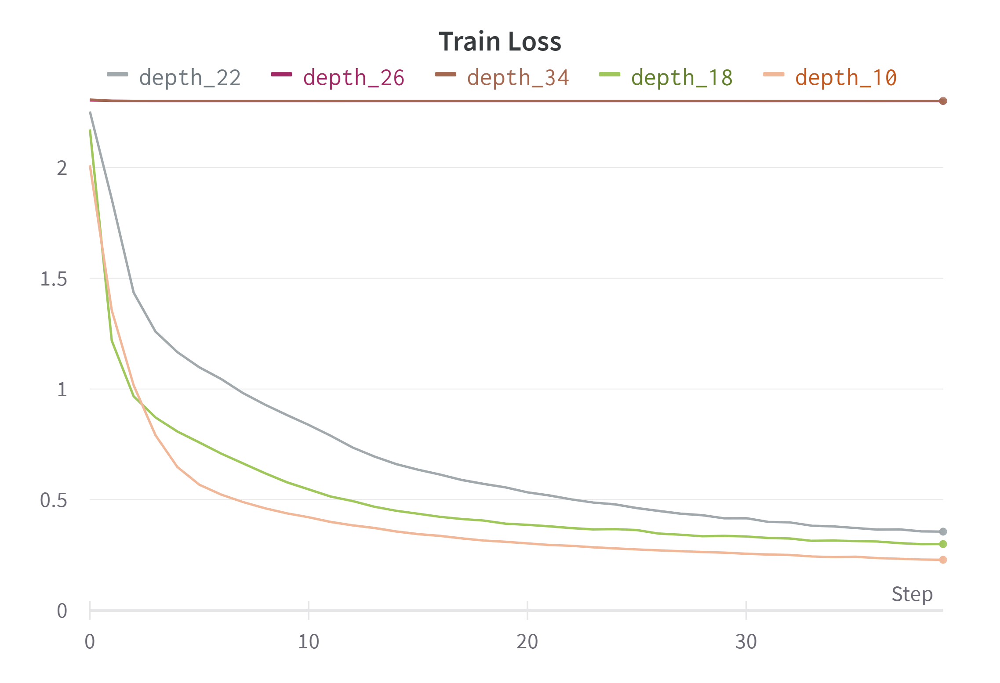
  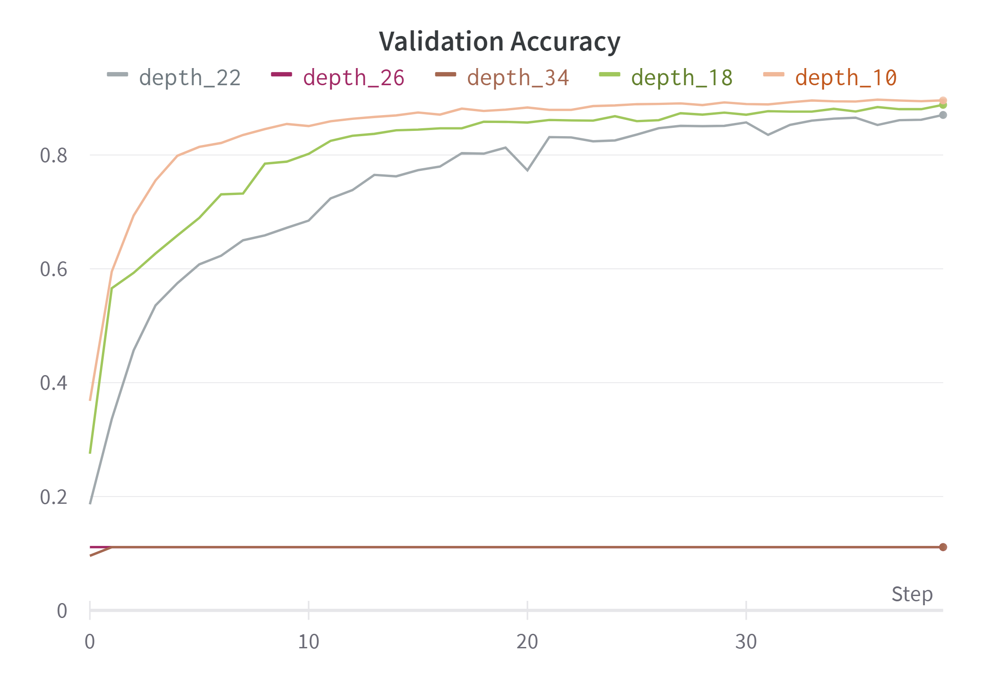 
</p>


As we can see, increasing the depth doesn't mean increase in performance. In particular we see in this case that for depth 26 and 34, the traing doesn't advance. We suspected that this problem arose from the fact that there could be a vanishing gradient problem with the increasing depth.

<p float="left" align="center">
  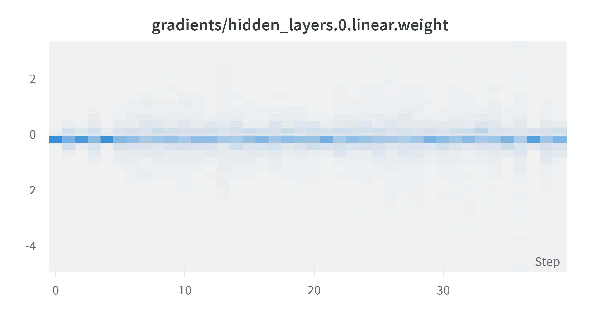
  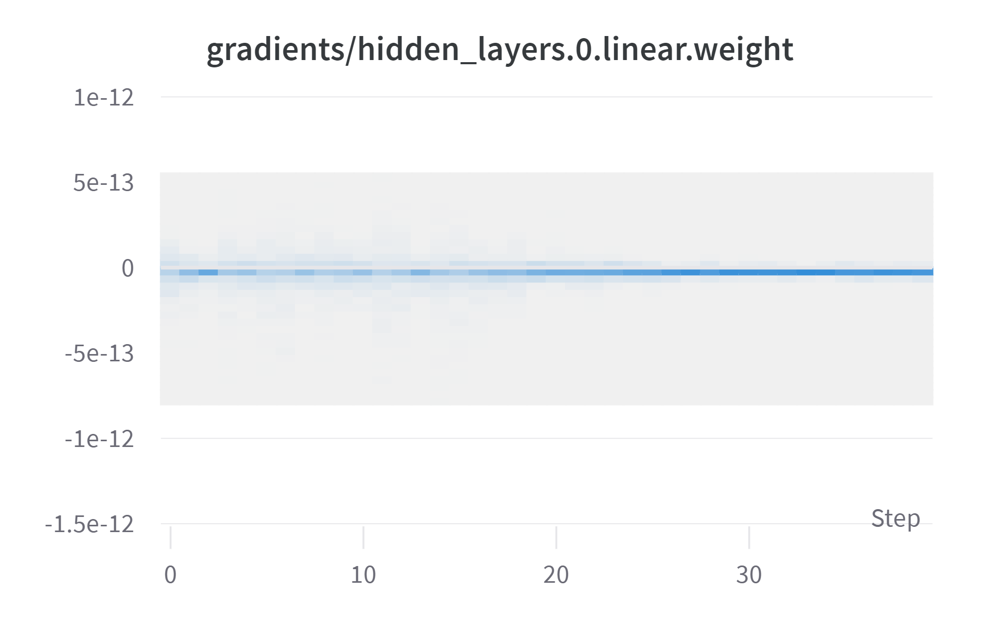 
</p>

This two plots show the magnitude of the gradients at the first hidden layers for two MLPs chosen from the experiment above, respectively the 22 and 34 depth MLPs. This shows that there is indeed a vanishing gradient problem with the increase of depth as the magnitudes of the gradients for the depth 34 MLP are basically 0.

<p align="right">(<a href="#readme-top">back to top</a>)</p>

## Excercise-2

Here we compare the performance of a convolutional model, varying the number of convolutions, with and without residual connections.

<p float="left" align="center">
  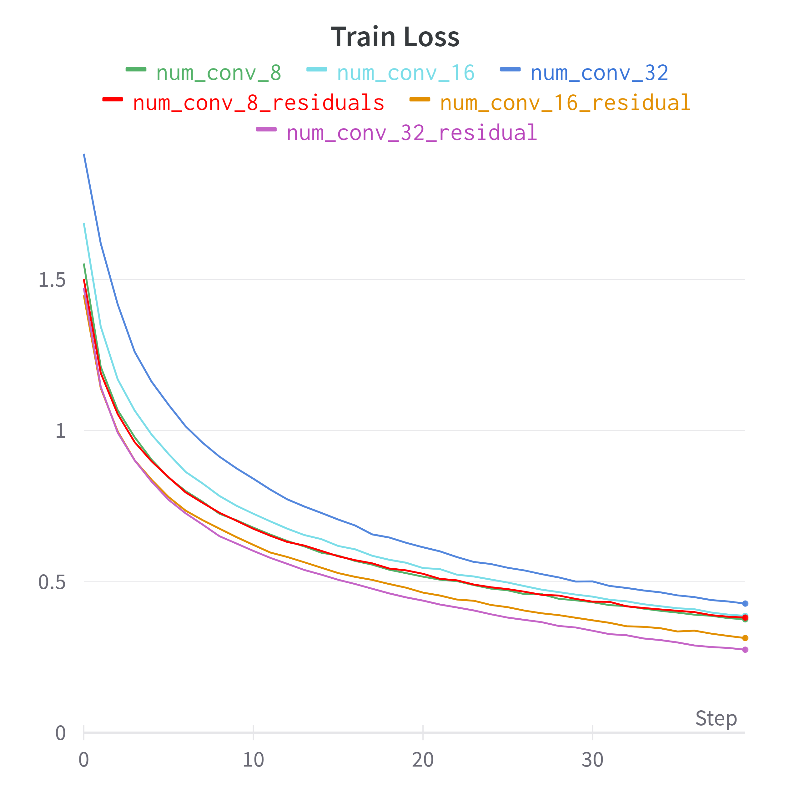
  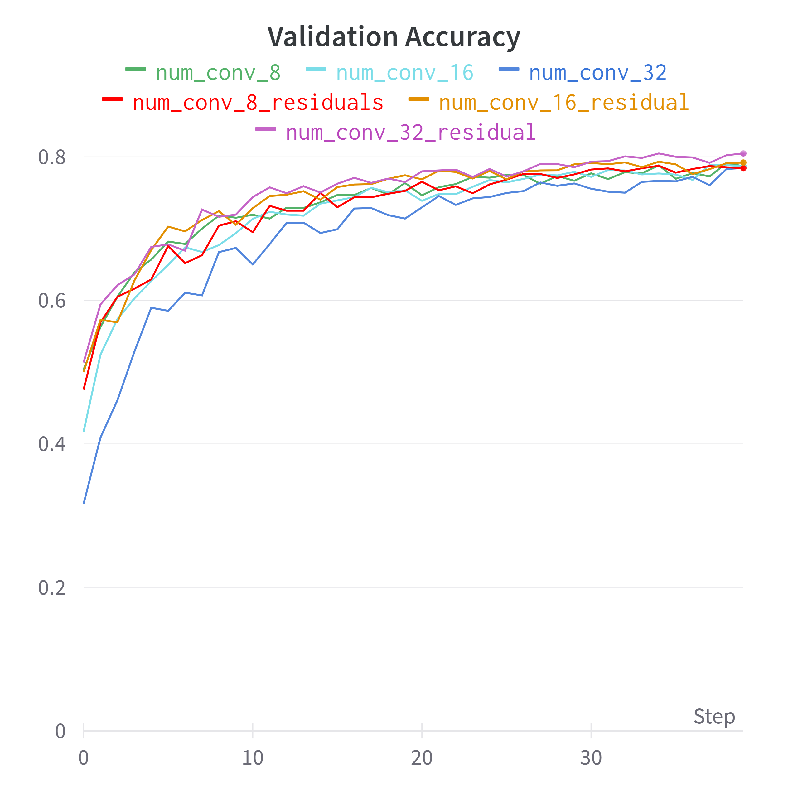 
</p>

We can see that the train loss behave like in the previous exercise. As the depth increases the convergence value of the train loss increases as well. This behavior is less evident in the validation accuracy plot.

<p align="right">(<a href="#readme-top">back to top</a>)</p>

## Excercise-3

Following the "CAM paper" we implemented CAM acivation maps for our convolutional model. Activation maps we'll give us a sense of what part of the images the network attended to give us a prediction of the class it belongs to. The major limiti of this method is that it can be used only with convolutional architectures that end with a Global Average Pooling and Linear Layers.

<p float="left" align="center">
  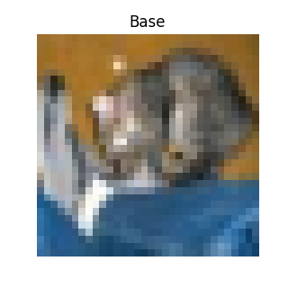
  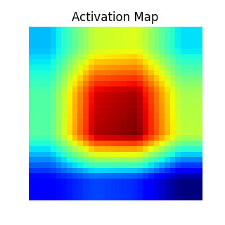
  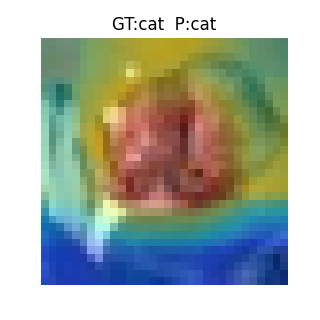 
</p>

<p float="left" align="center">
  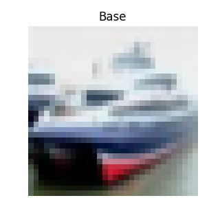
  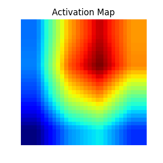
  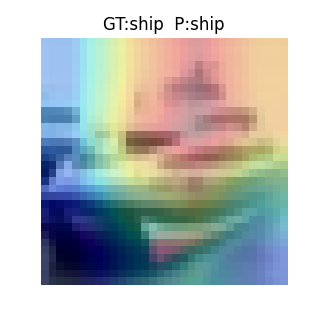 
</p>

<p float="left" align="center">
  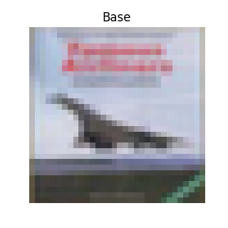
  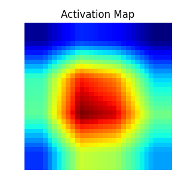
  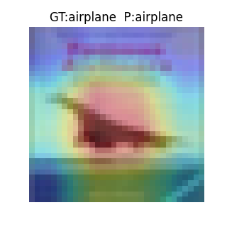 
</p>

Of course if the prediction is correct, we can see that the activation maps usually corresponds to the area of interest that also we can discern; if instead the prediction of the network is wrong, this assumption is not true anymore.

<p float="left" align="center">
  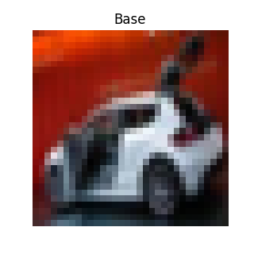
  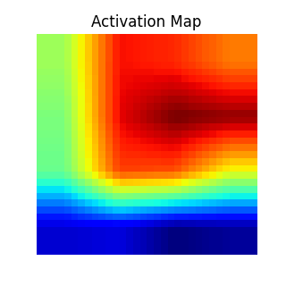
  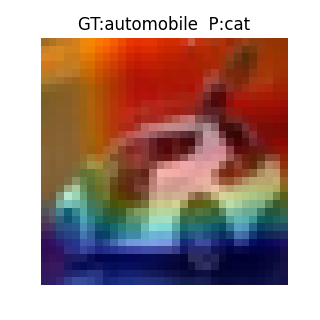 
</p>

In this example we can see that the network predicts cat instead of automobile; the activation map misses to highlight important features such as the tires of the automobile.

As a bonus we tried to produced an activation map for an higher resolution image, by resizing it to fit the architecture trained on CIFAR10.

<p float="left" align="center">
  
  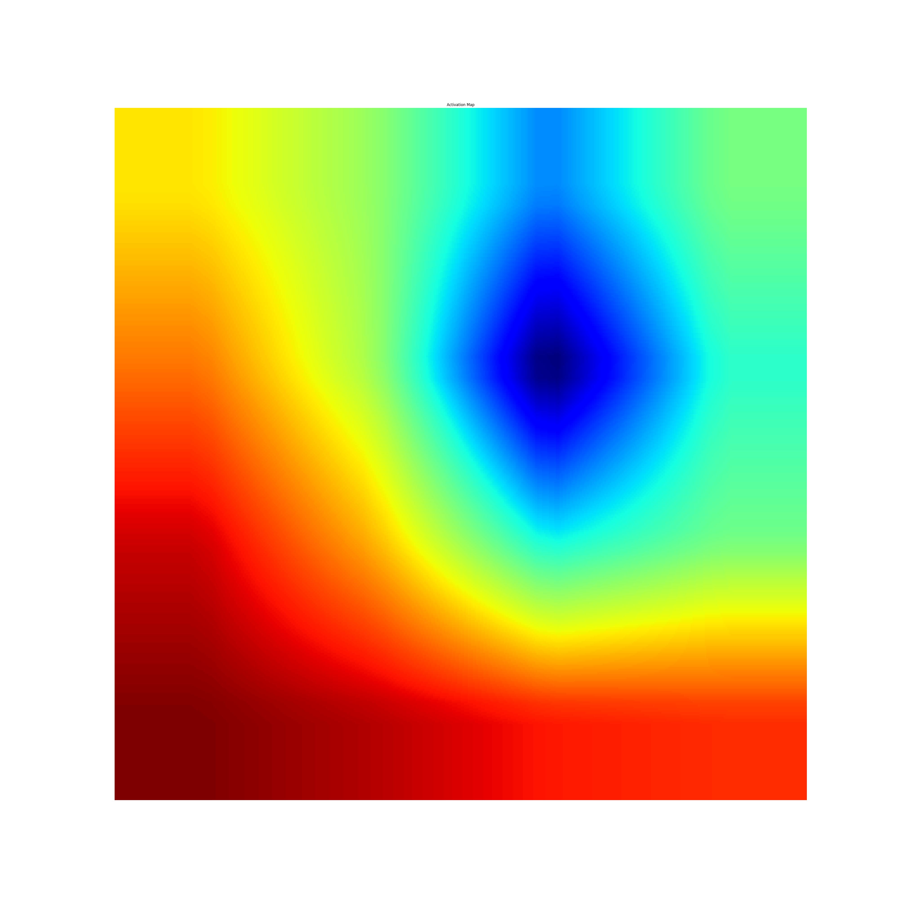
   
</p>

<p align="right">(<a href="#readme-top">back to top</a>)</p>


<!-- MARKDOWN LINKS & IMAGES -->
<!-- https://www.markdownguide.org/basic-syntax/#reference-style-links -->

[PyTorch-url]: https://pytorch.org/
[Pytorch.org]:https://img.shields.io/badge/PyTorch-%23EE4C2C.svg?style=for-the-badge&logo=PyTorch&logoColor=white