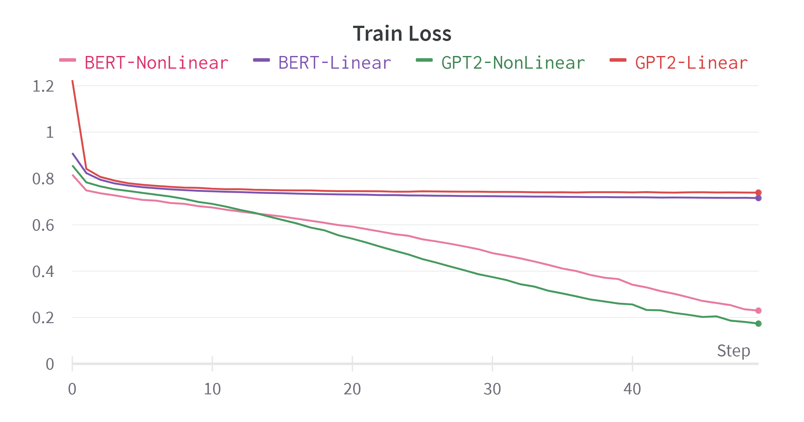
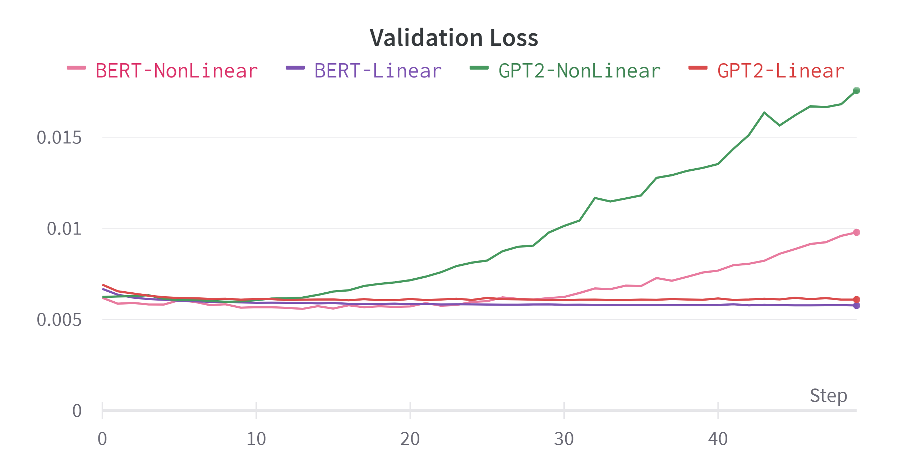
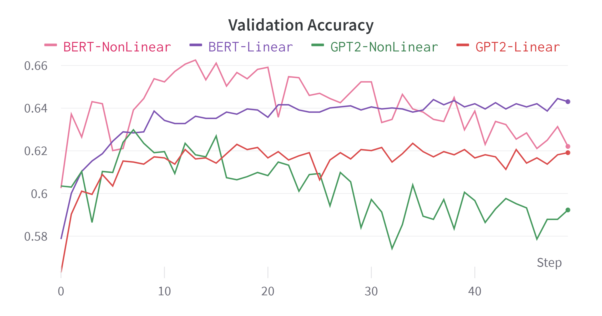

<a name="readme-top"></a>


<!-- PROJECT LOGO -->
[![Pytorch][Pytorch.org]][PyTorch-url]
<br />
<div align="center">

  <h3 align="center">Laboratory 3</h3>

  <p align="center">
    Use of Large Language Models
  </p>
</div>


<!-- TABLE OF CONTENTS -->
<details>
  <summary>Table of Contents</summary>
  <ol>
    <li>
      <a href="#about-the-project">About The Project</a>
    </li>
    <li>
      <a href="#getting-started">Getting Started</a>
      <ul>
        <li><a href="#prerequisites">Prerequisites</a></li>
        <li><a href="#functionalities">Functionalities</a></li>
      </ul>
    </li>
    <li><a href="#excercise1">Excercise 1</a></li>
    <li><a href="#excercise2">Excercise 2</a></li>
    <li><a href="#excercise3">Excercise 3</a></li>
  </ol>
</details>


<!-- ABOUT THE PROJECT -->
## About The Project

In this Laboratory we experimented with LLM(Large Language Models). The objective was to become familiar with these models as they are the current major topic of AI.

<p align="right">(<a href="#readme-top">back to top</a>)</p>

<!-- GETTING STARTED -->
## Getting Started

### Prerequisites

To execute this code you have to create the right virtual environment, following the instructions on the README in the main folder and running the code from this folder.

### Functionalities
To run gpt.py you can change the parameters inside the file
```
gpt.py
```

To run Decoding.py you can run
```
Decoding.py
```
To see the possible arguments to pass to LLM_classification.py.py
```
LLM_classification.py.py -h
```

<p align="right">(<a href="#readme-top">back to top</a>)</p>


<!-- USAGE EXAMPLES -->
## Excercise1

Following Karapathy's video, we played with his implementation of gpt2 to predict text. In particular we choose Dante's Divina Commedia as input, to generate Dante's style text with this model. Here there is an extract of the result:

```
Inferno: Canto IVII


Loco e` in parlan, due perche' ntrariva
  un pennto anto` rie metto al ciel pete;
  per che mi pur mo ch'a prio puntio.

Moltro al far, se benen di Guido altro mondo,
  aveder la men tre che tu siegu` forte
  verribi due miglia fede avanni

dipio` de l'altima bolgiate dal cozzo,
  si` fatto che tu vedi; edi la`, si` sazio?
  diche' di qual disio loco atte alquatta?

Se lungi la siete sta prima, a cotando
  la prima che tal piu` ti spadigne>>.

Poscia comincia' io a lui: <<Ose lezzo
  sotto lo scente ristra 'l mondo cinge da la pieta.
```

<p align="right">(<a href="#readme-top">back to top</a>)</p>

## Excercise2

Here we used the Hugging Face library to achieve results similar to the previous excercise. We downloaded a pretrained model of GPT2 from Hugging Face and gave it a short input to make it predict the next tokens and generate a new part of the sentence.

Obtained the predictions, the decoding phase is fundamental to obtain good text.

```
The future of Artificial Intelligence is in the hands of the next generation of AI.

The future of Artificial Intelligence is in the hands of the next generation of AI.

The future of Artificial Intelligence is in the hands of the next generation of
```

The greedy search doesn't give us a good result overall as it chooses the highest probability token at each step, leaving behind possible sequences that can have higher probability in total. to resolve this problem we have for example, the Beam Search

```
0: The future of Artificial Intelligence is in the hands of the next generation of intelligent machines.

This article was originally published on Wired.com.
1: The future of Artificial Intelligence is in the hands of the next generation of intelligent machines.

This article was originally published on Wired.com
2: The future of Artificial Intelligence is in the hands of the next generation of intelligent machines.

This article was originally published on Medium.
3: The future of Artificial Intelligence is in the hands of the next generation of intelligent machines.

This article was originally published on TechRepublic.com
4: The future of Artificial Intelligence is in the hands of the next generation of intelligent machines.

This article was originally published on TechRepublic.com.
```

Here we choose to use 5 beams and to produce 5 sequences. To avoid repeating words a parameter no_repeat_ngram_size is used. We can see this method can give us various results to choose from. But they are not that different from the greedy method.

```
The future of Artificial Intelligence is coming up. But the real revolution has yet to take place – even at the most basic level of human interaction.

According toGerman research chief Andreas Thorne (d. 2005), "we
```

This last method produce more complex and human-like sentence. This decoding method is Top-K, the one used in GPT2. Very briefly given a word, we sample the next word from the K most probable words. This process is iterated for each temporal step.  

<p align="right">(<a href="#readme-top">back to top</a>)</p>

## Excercise3

We used LLMs to perform sentence classification. In particular we employed two different LLMs: GPT2 and DistillBERT. Different from BERT that as a special class token (CLS) to perform classification, GPT2 was not designed for that. We decided to use the last hidden state(excluding padding) to perform classification as in theory contains information on the whole sentence.

To perform classification we considered a sentiment analysis task on a dataset composed of Twitter posts. We used a Linear and a Non-Linear classifier on top of the two models. We trained only the classifiers, as the process of finetuning GPT2 and BERT is too demanding.


<p float="left" align="center">
  
   
   
</p>

<p align="right">(<a href="#readme-top">back to top</a>)</p>

First thing to notice is that with the Non-Linear classifier we incurred in overfitting. This can be addressed easily by employing some form of regularization. 

Second we noticed that in both cases BERT outperforms GPT2, This is expected as BERT was designed also to be used for classification tasks, while GPT2 is only adapted for this task.


<!-- MARKDOWN LINKS & IMAGES -->
<!-- https://www.markdownguide.org/basic-syntax/#reference-style-links -->

[PyTorch-url]: https://pytorch.org/
[Pytorch.org]:https://img.shields.io/badge/PyTorch-%23EE4C2C.svg?style=for-the-badge&logo=PyTorch&logoColor=white