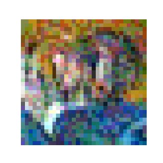

<a name="readme-top"></a>


<!-- PROJECT LOGO -->
[![Pytorch][Pytorch.org]][PyTorch-url]
<br />
<div align="center">

  <h3 align="center">Laboratory 4</h3>

  <p align="center">
    Out of Distribution Detection, Adversarial Attack and Adversarial Training

  </p>
</div>


<!-- TABLE OF CONTENTS -->
<details>
  <summary>Table of Contents</summary>
  <ol>
    <li>
      <a href="#about-the-Laboratory">About The Project</a>
    </li>
    <li>
      <a href="#getting-started">Getting Started</a>
      <ul>
        <li><a href="#prerequisites">Prerequisites</a></li>
        <li><a href="#functionalities">Functionalities</a></li>
      </ul>
    </li>
    <li><a href="#excercise-1:-OOD-Detection">Excercise 1</a></li>
    <li><a href="#excercise-2:-Adversarial-Attacks-and-Training-with-FGSM">Excercise 2</a></li>
    <li><a href="#excercise-3:-Targeted-FGSM">Excercise 3</a></li>
  </ol>
</details>


<!-- ABOUT THE PROJECT -->
## About The Laboratory

In this Laboratory we implemented a simple OOD detection ppipeline and the FGSM(Fast Gradient Sign Method) attack to evaluate the produced adversarial samples and the robustness of a convolutional model to adversarial attacks. Then we used this attack to perform adversarial training and implemented also a Targeted FGSM attack.

<p align="right">(<a href="#readme-top">back to top</a>)</p>

<!-- GETTING STARTED -->
## Getting Started

### Prerequisites

To execute this code you have to create the right virtual environment, following the instructions on the README in the main folder and running the code from this folder.

### Functionalities
To see the possible arguments to pass to pipeline_FGSM.py
```
pipeline_FGSM.py -h
```
To see the possible arguments to pass to pipeline_OOD.py, NOTE: here you have to load a trained model with the previous pipeline_FGSM
```
pipeline_OOD.py -h
```

<p align="right">(<a href="#readme-top">back to top</a>)</p>


<!-- USAGE EXAMPLES -->
## Excercise 1: OOD Detection

Here we implemented a simple OOD detection pipeline. We used the logits of the predictions as a score to evaluate if samples are in or out of distribution. We built histograms, ROC curves and Precision-Recall curves using different metrics.

<p  float="left" align="center" style="background-color:None">
    
    
    
</p>

<p  float="left" align="center" style="background-color:None">
    
    
    
</p>

<p  float="left" align="center" style="background-color:None">
    
    
    
</p>


Just using the histograms we can see that only with the max metric we have a some kind of distinction between the two distributions.

<b float="left" align="center">ROC CURVES</b>
<p  float="left" align="center" style="background-color:None">
    
    
    
</p>

<b float="left" align="center">PRECISION RECALL CURVES</b>
<p  float="left" align="center" style="background-color:None">
    
    
    
</p>

The statement above is confirmed by the observation of the ROC curves and Precision-Recall curves. We can see that the classifiers using the mean and variance of logits are no good. From the ROC curves we see that the performance is equivalent to a random choice; from the Precision Recall curves we see that it converges fast to the ratio of Positives example over the entire set(No Skill line), menaning that all the samples are classified as positives.

<p align="right">(<a href="#readme-top">back to top</a>)</p>

## Excercise 2: Adversarial Attacks and Training with FGSM

We implemented the FGSM attack to experiment with adversarial attacks and adversarial training. First we evaluate the quality of the adversaral samples, in relation with the value of epsilon.

<b float="left" align="center">EPSILON = 0.01 ACCURACY: 0.82  ATTACKED ACCURACY: 0.56</b>
<div  float="left" align="center" style="background-color:rgb(240,240,240)">
  <p  float="left" align="center">
    
    
    
    
  </p>
</div>

<b float="left" align="center">EPSILON = 0.015 ACCURACY: 0.82  ATTACKED ACCURACY: 0.50</b>
<div  float="left" align="center" style="background-color:rgb(240,240,240)">
  <p  float="left" align="center">
    
    
    
    
  </p>
</div>

<b float="left" align="center">EPSILON = 0.03 ACCURACY: 0.82  ATTACKED ACCURACY: 0.40</b>
<div  float="left" align="center" style="background-color:rgb(240,240,240)">
  <p  float="left" align="center">
    
    
    
    
  </p>
</div>

<b float="left" align="center">EPSILON = 0.05 ACCURACY: 0.82  ATTACKED ACCURACY: 0.31</b>
<div  float="left" align="center" style="background-color:rgb(240,240,240)">
  <p  float="left" align="center">
    
    
    
    
  </p>
</div>

<b float="left" align="center">EPSILON = 0.1 ACCURACY: 0.82  ATTACKED ACCURACY: 0.22</b>
<div  float="left" align="center" style="background-color:rgb(240,240,240)">
  <p  float="left" align="center">
    
    
    
    
  </p>
</div>


As we can see attacking the model brings down the performance of the model. But we can also observe that beyond a certain epsilon value we see a degradation of the image that is pretty visible to a human observer. So the attack is more effective in term of accuracy drop, but can be easily be detected.

Now we perform adversarial training to make the model more robust to this kind of attacks, with epsilon = 0.015.

<p  float="left" align="center" style="background-color:None">
    
    
    
</p>

<b float="left" align="center">Attacked Accuracy on Test: 0.42</b>

There is an anomaly in the results. It seems that adversarial training doesn't increase the robustness of the model to adversarial attacks. As this result is higly improbable I suspect that there is a bug in the implementation of the fgsm adversarial training. As of now i couldn't find it.

<p align="right">(<a href="#readme-top">back to top</a>)</p>

## Excercise 3: Targeted FGSM

A variant of FGSM is the Targeted FGSM. Here we can choose a target class to guide the adversarial attack. The objective is make the model classify the input images as the target class.

To perform the attack we have to use relative small value for epsilon. As with the non targeted attack, too great of an epsilon will result in too much noised images. But we have also to iterate the attack to make it effective. We show the results of two attacks with different class targets, "deer" and "car" and different epsilons, 0.01 and 0.015.

<b float="left" align="center">Iteration steps: 1, 2, 3, 4, 5, 10</b>


<b float="left" align="center">EPSILON = 0.01, CLASS TARGET: "car"</b>

<div  float="left" align="center" style="background-color:rgb(240,240,240)">
  <p  float="left" align="center" style="background-color:None">
    
    
     
    
    
    
  </p>

  <p  float="left" align="center">
    
    
    
    
    
    
  </p>


<p  float="left" align="center">
  
  
  
  
  
  
</p>

<p  float="left" align="center">
  
  
  
  
  
  
</p>
</div>

<b float="left" align="center">EPSILON = 0.015, CLASS TARGET: "car"</b>

<div  float="left" align="center" style="background-color:rgb(240,240,240)">
  <p  float="left" align="center">
    
    
     
    
    
    
  </p>

  <p  float="left" align="center">
    
    
    
    
    
    
  </p>

  <p  float="left" align="center">
    
    
    
    
    
    
  </p>

  <p  float="left" align="center">
    
    
    
    
    
    
  </p>
</div>

<b float="left" align="center">EPSILON = 0.01, CLASS TARGET: "deer"</b>
<div  float="left" align="center" style="background-color:rgb(240,240,240)">
  <p  float="left" align="center">
    
    
     
    
    
    
  </p>

  <p  float="left" align="center">
    
    
    
    
    
    
  </p>

  <p  float="left" align="center">
    
    
    
    
    
    
  </p>

  <p  float="left" align="center">
    
    
    
    
    
    
  </p>
</div>

<b float="left" align="center">EPSILON = 0.015, CLASS TARGET: "deer"</b>

<div  float="left" align="center" style="background-color:rgb(240,240,240)">
  <p  float="left" align="center">
    
    
     
    
    
    
  </p>

  <p  float="left" align="center">
    
    
    
    
    
    
  </p>

  <p  float="left" align="center">
    
    
    
    
    
    
  </p>

  <p  float="left" align="center">
    
    
    
    
    
    
  </p>
</div>

--------------------------------------------------------

We can see that a lot of iterations brings too much noise as we expected. The success of the attack really depends on the combination of number of iterations and epsilon value. We see also that some images reach the objective, but, as the iterations advance we lose succesfull attacks. This suggest that setting the iterations as an upper limit rather than as a fixed number of iterations to do, could be a good choice. We can also notice that the success of the attac on an image depends on the class target: choosing a target based on the original class seems a good way to enanche the performance of the attack.

Now we show the effectivness of the attacks on the whole dataset. We show the confusion matrices of two attacks epsilon 0.1 and class target "car" and "deer", at iteration 1 and 10.

<b align="center">CLASS TARGET: "car"</b>
<p  float="left" align="center">
  
  
</p>

<b float="left" align="center">CLASS TARGET: "deer"</b>
<p  float="left" align="center">
  
  
</p>

For both the attacks we can see that there is an increase in examples that are classified as the class target. The first confusion matrices are relative to the "car" target, the second to the "deer" target. 

<p align="right">(<a href="#readme-top">back to top</a>)</p>


<!-- MARKDOWN LINKS & IMAGES -->
<!-- https://www.markdownguide.org/basic-syntax/#reference-style-links -->

[PyTorch-url]: https://pytorch.org/
[Pytorch.org]:https://img.shields.io/badge/PyTorch-%23EE4C2C.svg?style=for-the-badge&logo=PyTorch&logoColor=white